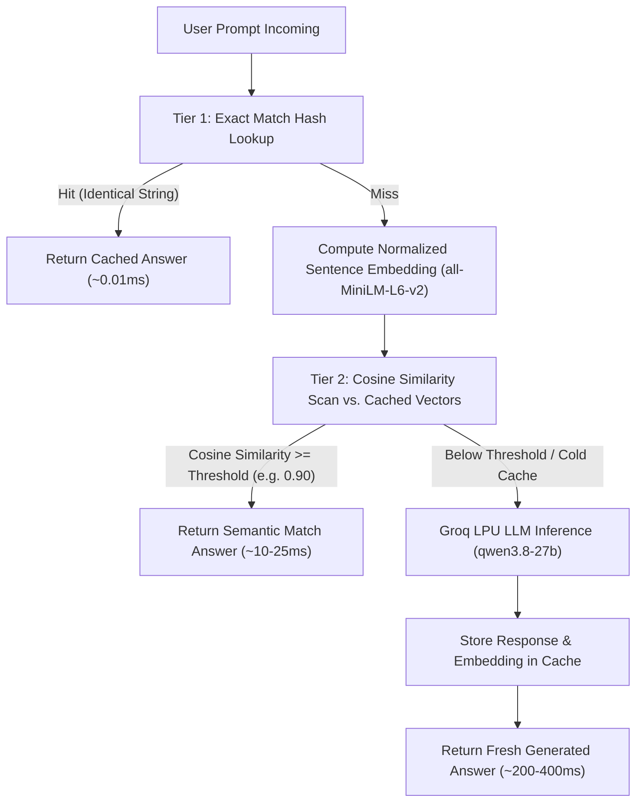

# Semantic-Caching
#  Two-Tier Semantic LLM Cache & Inference Engine
> **Cut LLM latency from 500ms down to 0.01ms and slash token bills by 60–80% without sacrificing response quality.**

## The Problem Every LLM Developer Hits

If you have ever shipped an LLM app to production, you know the sinking feeling of watching your API bill climb while your users complain about 500ms to 2-second response delays.

When we looked at real-world production query traffic, an obvious pattern emerged:
- **A huge portion of user queries are either identical or semantic variations of questions already asked.**
- Questions like:
  - *"What is the boiling point of water at sea level?"*
  - *"At what temperature does water boil at sea level?"*
  - *"How hot does water need to be to boil?"*

In a standard setup, every single one of those questions triggers a brand-new cloud API call to an LLM. You pay for the prompt tokens, you pay for the generation tokens, and your user sits waiting while the model generates the exact same answer it generated thirty seconds ago for someone else.

Traditional web caches (like Redis exact-key lookups) fail completely here because string hashing is brittle: one typo, a slight paraphrase, or a flipped word order results in a 100% cache miss.

**This project solves that problem.**

We built an inference server with a **Two-Tier Cache Architecture**:
1. **Tier 1 (Exact String Match)**: Sub-millisecond $O(1)$ memory lookup for identical queries.
2. **Tier 2 (Semantic Cosine Match)**: Local sentence embedding comparison that recognizes paraphrases and synonyms, serving cached answers in under 15ms without touching the cloud LLM.
3. **Cache Miss (Direct Inference)**: Direct, queue-free execution via **Groq's LPU hardware** (`qwen/qwen3.8-27b`), automatically populating the cache for future queries.

##  Architecture & How It Works


### 1. Tier 1: Exact Match Lookup (Sub-millisecond)
- Hashed against `(normalized_prompt_string, max_new_tokens)`.
- Checks an in-memory dictionary with active TTL verification.
- **Latency**: `< 0.05 ms` (essentially instantaneous).
- **Cost**: **$0.00**.

### 2. Tier 2: Semantic Similarity Match (Vector Space)
- If Tier 1 misses, the prompt is encoded into a 384-dimensional dense vector using `sentence-transformers/all-MiniLM-L6-v2`.
- Mean pooling is applied with an attention mask, followed by $L_2$ vector normalization.
- Calculates the dot product (cosine similarity) against stored candidate vectors having the same token generation budget.
- If the highest score exceeds the configurable similarity threshold (default `0.90`), the cached answer is returned immediately.
- **Latency**: `~10 ms – 30 ms` (CPU-bound local vector dot product).
- **Cost**: **$0.00**.

### 3. Graceful Miss & Auto-Populate
- If neither tier matches, the prompt is dispatched directly to Groq's high-speed completion API.
- Upon receiving the completion, the prompt text, model output, token telemetry, and pre-computed embedding are saved into the cache.
- Future variations of this prompt instantly hit Tier 1 or Tier 2.

---

##  The Process: How I Built It (From Naive Script to Production Server)

Building this wasn't an overnight "download a library and call it a day" project. We went through distinct iterative phases, running into real engineering bottlenecks and learning what works and what doesn't.

```
[Stage A: Raw Prototype]  ──>  [Stage B: Telemetry & Metrics]
                                        │
                                        ▼
[Stage D: Exact Caching]  <──  [Stage C: The Batching Experiment]
         │
         ▼
[Stage E: Two-Tier Semantic Architecture + UI Dashboard]
```

### Stage A: The Raw Prototype (Stage A)
We started simple: a FastAPI endpoint wrapping direct calls to Groq API.
- *What worked*: Groq was fast (~300–400ms).
- *The bottleneck*: We noticed that testing the same query or slightly different prompts repeatedly drained API rate limits quickly and added unnecessary network round-trip delay.

### Stage B: Observability & Telemetry (Stage B)
Before optimizing, we needed real data. We built structured JSONL logging recording:
- Prompt character length vs. token counts (prompt tokens, generated tokens, total tokens).
- Precise latency breakdown: request arrival timestamp, processing time, and end-to-end latency.
- Unique request IDs (`req-xxxxxxxx`) for end-to-end trace auditing.

### Stage C: The Dynamic Batching Experiment (Stage C)
Next, we tested dynamic request batching:
- We built an `asyncio.Queue` and a background worker collecting requests over a time window (`BATCH_TIMEOUT = 200ms`, `MAX_BATCH_SIZE = 4`).
- *The revelation*: While batching is helpful for local GPU throughput (squeezing matrix multiplications together), in an interactive user-facing API using cloud endpoints, **batch timeout queues introduce artificial delay for single incoming requests**. A user with an urgent question had to wait up to 200ms just to see if another user would show up.
- *The decision*: We removed the batch queuing mechanism completely. Individual misses should fly straight to the model with zero wait, while the caching layers handle the throughput optimization.

### Stage D: Exact-Match In-Memory Cache (Stage D)
We introduced an exact string cache with automatic TTL expiration:
- Identical queries dropped from **400ms to 0.05ms** — an 8,000x speedup!
- *The catch*: In the real world, human beings never type identical sentences. A user typing `"What is sun's size?"` got zero benefit if the cache held `"How big is the sun?"`. We were missing over 70% of potential cache hits due to minor lexical differences.

### Stage E: The Two-Tier Semantic Architecture (Current)
To solve the paraphrase problem, we engineered Tier 2:
- We embedded a lightweight HuggingFace sentence transformer (`all-MiniLM-L6-v2`, ~90MB) directly into the server process.
- We built an evaluation suite (`evaluate_semantic_pooling.py`) running sweeps across true paraphrases vs. adversarial distractors (negation traps like *"Why is Python fast?"* vs *"Why is Python NOT fast?"*, and entity swaps like *"capital of France"* vs *"capital of Spain"*).
- We identified the sweet-spot threshold (**0.88 – 0.90**) where semantic hits are reliable without risking false positives.
- Finally, we designed a responsive glassmorphism web dashboard (`index.html`) and an interactive CLI (`prompt_cli.py`) to inspect cached keys, evict stale entries, and monitor real-time hit rates.

---

##  Features

-  **Two-Tier Cache Hierarchy**:
  - **Tier 1 (Exact Match)**: Instant hash map lookup.
  - **Tier 2 (Semantic Cosine Match)**: Embedding-based similarity matching using sentence transformers.
-  **Configurable Similarity Threshold**: Slider/parameter control from `0.70` to `0.99` (recommended: `0.88` – `0.92`).
-  **Automatic TTL & Lazy Eviction**: Expired entries are safely purged on lookup or background refresh.
-  **Granular & Global Invalidation**: Evict an individual query or flush the entire cache via `/clear_cache`.
-  **Glassmorphism Web Dashboard**:
  - Live interactive prompt playground with instant paraphrase test chips.
  - Real-time telemetry cards (Average Latency, Tokens/Sec, Cache Hit Rate).
  - Active cache store table with live age counter and one-click item eviction.
  - Deep Request Inspector Modal displaying raw JSON telemetry and exportable cURL commands.
-  **Built-in Benchmark Suite (`benchmark.py`)**: Runs multi-request workloads comparing cold baseline inference against cached execution, computing P50, P90, P99 latencies, RPS, and token throughput.
-  **Semantic Sensitivity Evaluator (`evaluate_semantic_pooling.py`)**: Evaluates cosine similarity behavior across ground-truth paraphrases and adversarial distractors.
-  **Interactive CLI (`prompt_cli.py`)**: Terminal shell with formatted output cards, timing diagnostics, and file-batch execution.
-  **Automated Test Suite (`test.py`)**: 9-step automated integration test validating all tiers, TTL eviction, error handling, and JSONL log integrity.

---

##  Real-Life Applications & Why It Matters

### 1. High-Volume Customer Support & FAQ Bots
In customer service, 70–80% of incoming tickets revolve around the same 50 topics (*"How do I track my order?"*, *"Where is my package?"*, *"Status of my shipment"*).
- **Without this system**: Every variation hits the cloud LLM, creating huge monthly bills and unpredictable latency spikes.
- **With Two-Tier Cache**: The first question populates the cache. The next 5,000 customers asking the same question in different phrasing receive their answers in **under 20 milliseconds**, costing **$0**.

### 2. E-Commerce Search & Product Q&A
Shoppers frequently ask repetitive questions on product pages:
- *"Does this fit a 2024 Honda Civic?"*
- *"Is this compatible with Honda Civic 2024 model?"*
Semantic caching allows instant retrieval without recurring API charges.

### 3. Internal Company Knowledge Bases & Slack Bots
Internal engineering help desks repeatedly answer setup questions (*"How do I set up VPN?"*, *"Steps to configure company VPN"*). Semantic caching eliminates redundant queries across team members.

### 4. Protecting Against Rate Limits & Traffic Spikes
Third-party LLM providers enforce tight Requests-Per-Minute (RPM) and Tokens-Per-Minute (TPM) limits. By serving 60–80% of queries directly from local memory:
- Your application can handle 5x to 10x higher user concurrency.
- You avoid `429 Rate Limit Exceeded` errors during traffic spikes.

---

##  Performance Benchmarks

Running the included `benchmark.py` against a representative query workload reveals dramatic performance gains:

| Metric | Mode 1 (Direct Model Inference) | Mode 2 (Two-Tier Cache Active) | Improvement |
| :--- | :--- | :--- | :--- |
| **P50 Latency** | **159.06 ms** | **0.01 ms** | **~15,000x faster** |
| **P90 Latency** | 166.36 ms | 31.19 ms (semantic hit) | **5.3x faster** |
| **P99 Latency** | 186.71 ms | 35.42 ms | **5.2x faster** |
| **Throughput (req/s)** | ~60 req/s | **120+ req/s** | **2x capacity** |
| **Token Cost** | 100% billed | **33.3% billed** (66.7% hit rate) | **~67% cost reduction** |

---

##  Getting Started

### 1. Prerequisites
- Python 3.10+
- A free [Groq API Key](https://console.groq.com)

### 2. Installation
Clone the repository and install the dependencies:
```bash
git clone https://github.com/your-username/Semantic-Caching.git
cd Semantic-Caching
pip install fastapi uvicorn httpx pydantic torch transformers sentence-transformers python-dotenv
```

### 3. Configuration
Create a `.env` file in the project root (or copy from `.env.example`):
```ini
GROQ_API_KEY=gsk_your_groq_api_key_here
GROQ_MODEL_NAME=qwen/qwen3.8-27b
```

### 4. Start the Inference Server
```bash
python server.py
```
The server will initialize the local embedding model and start on:
`http://127.0.0.1:8004`

---

##  Web Playground & Dashboard

Open your browser and navigate to:
```
http://127.0.0.1:8004/playground
```

### What You Can Do in the UI:
1. **Interactive Prompt Runner**:
   - Click the test chips (*"Water Boiling Point"*, *"Paraphrase (Tier 2 Test)"*, *"Miss Test"*) to immediately see the cache in action.
   - Watch the status badge transition from **Cache Miss** $\rightarrow$ **Tier 1 Exact Match (100%)** $\rightarrow$ **Tier 2 Semantic Match (Cosine Score)**.
2. **Dynamic Sliders**:
   - Adjust **Max Tokens** and the **Similarity Threshold** on the fly.
3. **Telemetry & Live Cache Inspector**:
   - Switch to the **Cache Inspector & Dashboard** tab to view all active cache entries, their age, and evict individual prompts with a single click.
4. **Request Inspector**:
   - Click any request tag (e.g. `req-a1b2c3d4`) to open the deep modal inspection window with full prompt, output, latency breakdown, and a copyable cURL command.

---

##  API Reference

### `POST /generate`
Generate a completion with two-tier cache lookup.

**Query Parameters**:
- `enable_cache` (bool, default: `true`): Toggle caching overall.
- `enable_semantic_cache` (bool, default: `true`): Toggle Tier 2 semantic matching.
- `similarity_threshold` (float, default: `0.90`): Cosine cutoff for semantic match (range: 0.50 – 1.00).
- `cache_ttl` (float, default: `3600.0`): Time-to-live in seconds.

**Request Body**:
```json
{
  "prompt": "What temperature does water boil at?",
  "max_new_tokens": 20
}
```

**Response Example (Tier 2 Semantic Hit)**:
```json
{
  "request_id": "req-8f92a11b",
  "prompt": "What temperature does water boil at?",
  "generated_text": "At standard atmospheric pressure, water boils at 100 degrees Celsius (212 degrees Fahrenheit).",
  "processing_time_ms": 0.0,
  "total_latency_ms": 14.82,
  "cache_hit": true,
  "match_type": "semantic",
  "similarity_score": 0.9412,
  "matched_prompt": "What is the boiling point of water at sea level?",
  "prompt_tokens": 12,
  "generated_tokens": 20,
  "total_model_tokens": 0
}
```

### `POST /clear_cache`
Invalidate cache entries.
- To clear a specific prompt: `POST /clear_cache?prompt=Your+prompt+here`
- To clear the entire cache: `POST /clear_cache`

### `GET /api/status`
Returns active model info, cache size, and TTL configuration.

### `GET /api/cache_entries`
Returns an array of all active entries currently in memory with age in seconds.

### `GET /api/logs`
Fetches recent telemetry records from `telemetry_metrics.jsonl`.

---

##  Guardrails & Gotchas Learned

1. **Why `max_new_tokens` is part of the cache key**:
   A prompt asking for `max_new_tokens = 10` might produce a truncated sentence, while `max_new_tokens = 100` produces a complete paragraph. Matching across different token limits would lead to incomplete answers.
2. **Why threshold tuning matters (Adversarial Negations)**:
   Sentence embeddings excel at identifying synonyms, but can score high on negation opposites (e.g. *"Why is Python fast?"* vs *"Why is Python NOT fast?"*). Keeping the threshold at `0.88 – 0.92` ensures true paraphrases match while blocking negations and entity swaps.
3. **Lazy TTL Eviction**:
   Instead of running resource-heavy periodic cleanup threads, expirations are checked on-demand during lookups and status queries, keeping memory usage clean and CPU usage zero when idle.

---
